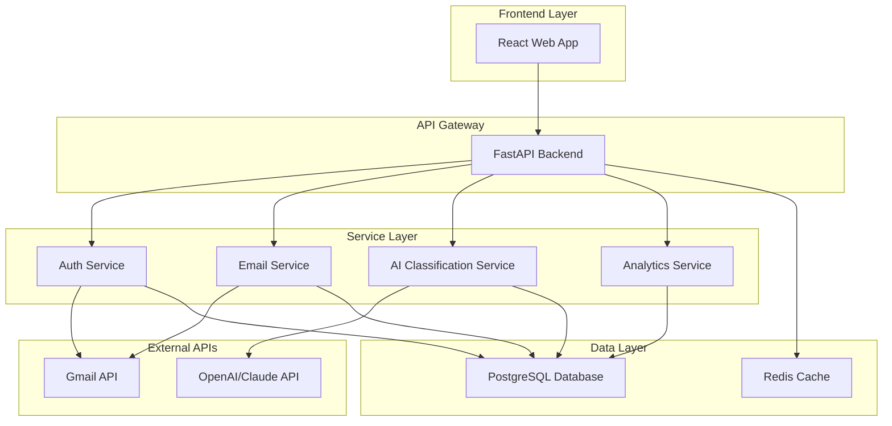

# Design Document

## Overview

ScrapIt is a web-based AI email cleaning application that leverages modern cloud technologies and machine learning APIs to automatically organize, categorize, and clean Gmail inboxes. The system uses a microservices architecture with Python backend services, React frontend, and PostgreSQL database, all containerized with Docker and deployed on AWS.

The application integrates Gmail API for email access, OpenAI/Claude APIs for intelligent classification, and scikit-learn clustering algorithms for email organization. The design prioritizes rapid development, scalability, and showcases multiple data science and computer science technologies.

## Architecture

### High-Level Architecture



### Technology Stack

**Frontend:**
- React 18 with TypeScript
- Material-UI for rapid UI development
- Axios for API communication
- Chart.js for analytics visualization

**Backend:**
- FastAPI (Python) for high-performance API
- SQLAlchemy ORM for database operations
- Celery for background task processing
- Redis for caching and task queue

**Machine Learning & AI:**
- OpenAI GPT-4 API for email classification
- Scikit-learn for clustering algorithms
- Pandas for data processing and analysis
- NLTK for text preprocessing

**Database & Storage:**
- PostgreSQL for structured data
- Redis for session management and caching

**Infrastructure:**
- Docker for containerization
- AWS ECS for container orchestration
- AWS RDS for managed PostgreSQL
- AWS ElastiCache for managed Redis
- AWS Application Load Balancer

## Components and Interfaces

### 1. Authentication Service

**Purpose:** Handles Google OAuth authentication and token management

**Key Components:**
- OAuth flow implementation using Google's Python client library
- JWT token generation for session management
- Token refresh mechanism for long-lived access

**API Endpoints:**
- `POST /auth/google` - Initiate Google OAuth flow
- `POST /auth/callback` - Handle OAuth callback
- `POST /auth/refresh` - Refresh access tokens
- `DELETE /auth/logout` - Logout and revoke tokens

### 2. Email Service

**Purpose:** Interfaces with Gmail API to fetch and manage emails

**Key Components:**
- Gmail API client wrapper
- Email metadata extraction
- Batch processing for large email volumes
- Rate limiting and retry logic

**API Endpoints:**
- `GET /emails/sync` - Sync emails from Gmail
- `GET /emails/list` - List emails with pagination
- `POST /emails/bulk-action` - Perform bulk operations
- `GET /emails/{id}` - Get specific email details

### 3. AI Classification Service

**Purpose:** Classifies emails using LLM APIs and clustering algorithms

**Key Components:**
- LLM API integration (OpenAI/Claude)
- Email content preprocessing
- K-means clustering for email grouping
- Feedback learning system

**API Endpoints:**
- `POST /classify/emails` - Classify batch of emails
- `POST /classify/feedback` - Submit user feedback
- `GET /classify/categories` - Get available categories
- `POST /cluster/emails` - Cluster emails for organization

### 4. Analytics Service

**Purpose:** Generates insights and visualizations from email data

**Key Components:**
- Email pattern analysis
- Spam detection statistics
- Cleanup effectiveness metrics
- Data export functionality

**API Endpoints:**
- `GET /analytics/dashboard` - Get dashboard data
- `GET /analytics/patterns` - Email pattern analysis
- `GET /analytics/export` - Export analytics data

## Data Models

### User Model
```python
class User:
    id: UUID
    email: str
    google_id: str
    access_token: str (encrypted)
    refresh_token: str (encrypted)
    created_at: datetime
    last_sync: datetime
```

### Email Model
```python
class Email:
    id: UUID
    user_id: UUID
    gmail_id: str
    subject: str
    sender: str
    recipient: str
    content: str
    received_date: datetime
    category: str
    confidence_score: float
    is_spam: bool
    cluster_id: int
    processed_at: datetime
```

### Classification Model
```python
class Classification:
    id: UUID
    email_id: UUID
    category: str
    confidence_score: float
    model_version: str
    user_feedback: str (optional)
    created_at: datetime
```

### Analytics Model
```python
class EmailAnalytics:
    id: UUID
    user_id: UUID
    total_emails: int
    emails_deleted: int
    emails_archived: int
    spam_detected: int
    categories_distribution: JSON
    analysis_date: datetime
```

## Error Handling

### API Error Responses
- Standardized error response format with error codes
- Detailed error messages for development
- User-friendly messages for production
- Proper HTTP status codes

### Gmail API Error Handling
- Rate limit detection and exponential backoff
- Token expiration handling with automatic refresh
- Network timeout and retry logic
- Quota exceeded graceful degradation

### LLM API Error Handling
- API key validation and rotation
- Request timeout handling
- Cost monitoring and limits
- Fallback to simpler classification methods

## Testing Strategy

### Unit Testing
- Python backend: pytest with coverage reporting
- React frontend: Jest and React Testing Library
- Database operations: SQLAlchemy test fixtures
- API endpoints: FastAPI test client

### Integration Testing
- Gmail API integration tests with mock responses
- LLM API integration tests with test data
- Database integration tests with test containers
- End-to-end API workflow tests

### Performance Testing
- Load testing with locust for API endpoints
- Database query performance optimization
- Email processing batch size optimization
- Memory usage monitoring for large email volumes

### Security Testing
- OAuth flow security validation
- Token encryption and storage testing
- SQL injection prevention testing
- API rate limiting validation

## Deployment Architecture

### Docker Configuration
- Multi-stage builds for optimized images
- Separate containers for frontend, backend, and workers
- Docker Compose for local development
- Health checks and restart policies

### AWS Infrastructure
- ECS Fargate for serverless container deployment
- Application Load Balancer for traffic distribution
- RDS PostgreSQL with automated backups
- ElastiCache Redis for session management
- CloudWatch for logging and monitoring

### CI/CD Pipeline
- GitHub Actions for automated testing
- Docker image building and pushing to ECR
- Automated deployment to staging environment
- Manual approval for production deployment

## Security Considerations

### Data Protection
- Encryption at rest for sensitive data
- TLS encryption for all API communications
- OAuth token encryption in database
- Regular security dependency updates

### Access Control
- JWT-based authentication
- Role-based access control (future enhancement)
- API rate limiting per user
- Input validation and sanitization

### Privacy Compliance
- Minimal data collection principle
- User data deletion capabilities
- Clear privacy policy and terms of service
- GDPR compliance considerations